<div align="center">

# Complete AI & Machine Learning Challenge
### *From Python Foundations to Cutting-Edge Artificial Intelligence & MLOps*

[](https://github.com/AmitKumarPrasad1846/Complete_AI_ML_challenge/stargazers)
[](https://github.com/AmitKumarPrasad1846/Complete_AI_ML_challenge/network/members)
[](https://www.python.org/)
[](https://numpy.org/)
[](https://jupyter.org/)
[](https://github.com/AmitKumarPrasad1846/Complete_AI_ML_challenge)
[](LICENSE)

<br/>

> *"Consistency is the DNA of mastery. One day, one script, one notebook at a time."*

[Explore Daily Tracker](#-daily-progress-tracker) • [Curriculum Roadmap](#-curriculum-roadmap) • [How to Run](#-quickstart--installation) • [Author & Connect](#-author--connect)

</div>

---

## 📌 About The Challenge

Welcome to the **Complete AI & Machine Learning Challenge**! 🎯

This repository documents an intensive, hands-on, **day-by-day journey** toward mastering the complete Artificial Intelligence, Machine Learning, Deep Learning, and Data Science ecosystem. 

Rather than passive theory, every single day focuses on:
- **Clean Code & Practical Implementation**: Writing raw Python, building algorithms from scratch, and harnessing industry-standard libraries.
- **Deep Conceptual Understanding**: Mastering *why* an algorithm works beneath the hood, not just *how* to call APIs.
- **Daily Discipline & Habit Tracking**: Continuous daily commits with documented code snippets, interactive notebooks, and mini-projects.
- **Production Readiness**: Progressing from beginner scripts to modular code, vectorization, deep learning architectures, and production MLOps pipelines.

---

## 🗺️ Curriculum Roadmap

```mermaid
flowchart LR
    A["01. Python Mastery\n(Core, Data Structures, OOPs)"] --> B["02. Numerical Computing\n(NumPy, Vectorization)"]
    B --> C["03. Data Wrangling\n(Pandas, Cleaning, Analysis)"]
    C --> D["04. Data Visualization\n(Matplotlib, Seaborn, EDA)"]
    D --> E["05. Math & Statistics\n(Linear Algebra, Calculus, Stats)"]
    E --> F["06. Machine Learning\n(Supervised, Unsupervised, Sklearn)"]
    F --> G["07. Deep Learning\n(PyTorch, Neural Networks, CNN, RNN)"]
    G --> H["08. NLP & Computer Vision\n(Transformers, OpenCV, LLMs)"]
    H --> I["09. Generative AI & MLOps\n(RAG, LangChain, Deployment)"]
```



---

## 📅 Daily Progress Tracker

> **Status Legend:**  
> ✅ **Completed** | 🟡 **In Progress** | ⏳ **Upcoming / Planned**

---

### 🐍 Phase 1: Python for Data Science & AI

Mastering core syntax, data structures, functional paradigms, and advanced Object-Oriented Programming (OOP).

| Day | Topic / Focus Area | Code / Notebook Link | Highlights & Core Concepts Covered | Status |
| :---: | :--- | :--- | :--- | :---: |
| **01** | Python Fundamentals & Syntax | [`code day 1.py`](01_Python/code%20day%201.py) | Python history, interpreted language, case sensitivity, print statements, syntax | ✅ Completed |
| **02** | Variables, Inputs & Type Casting | [`code day 2.py`](01_Python/code%20day%202.py) | Dynamic typing, user inputs (`input()`), type conversion (int, float, str), Colab | ✅ Completed |
| **03** | Python Operators | [`code day 3.py`](01_Python/code%20day%203.py) | Arithmetic, Comparison, Assignment, Logical, and Identity/Membership operators | ✅ Completed |
| **04** | List Fundamentals & Indexing | [`code day 4.py`](01_Python/code%20day%204.py) | List creation, positive indexing, negative indexing, basic slicing | ✅ Completed |
| **05** | List Slicing & Traversing | [`code day 5.py`](01_Python/code%20day%205.py) | Forward & reverse slicing `[start:stop:step]`, list boundary handling | ✅ Completed |
| **06** | List Methods & Manipulation | [`code day 6.py`](01_Python/code%20day%206.py) | `append()`, `insert()`, `remove()`, `pop()`, `sort()`, `reverse()`, element deletion | ✅ Completed |
| **07** | Tuples & String Operations | [`code day 7.py`](01_Python/code%20day%207.py) | Tuples, immutability, type casting tuples/lists, string repetition & slicing | ✅ Completed |
| **08** | Dictionaries & Key-Value Maps | [`code day 8.py`](01_Python/code%20day%208.py) | Dict initialization, nested dictionaries, `.keys()`, `.values()`, `.items()` | ✅ Completed |
| **09** | Sequential Data Types Overview | [`code day 9.py`](01_Python/code%20day%209.py) | Comparison of Sequences (List, Tuple, Set, Dict), memory characteristics | ✅ Completed |
| **10** | Conditional Logic & Flow Control | [`code day 10.py`](01_Python/code%20day%2010.py) | `if`, `elif`, `else` constructs, nested conditions, boolean evaluation | ✅ Completed |
| **11** | Loops & Iteration Mechanics | [`code day 11.py`](01_Python/code%20day%2011.py) | `for` loops, `range()` generator, multiplication tables, looping over sequences | ✅ Completed |
| **12** | Loop Control Statements | [`code day 12.py`](01_Python/code%20day%2012.py) | `pass` placeholder, `break` termination, `continue` skip, nested pattern loops | ✅ Completed |
| **13** | Sets & Mathematical Set Theory | [`code day 13.py`](01_Python/code%20day%2013.py) | Set creation, uniqueness, union (`\|`), intersection (`&`), difference (`-`) | ✅ Completed |
| **14** | OOPs Foundations: Class & Object | [`code day 14.py`](01_Python/code%20day%2014.py) | Real-world entity modeling, class definitions, object instantiation, methods | ✅ Completed |
| **15** | OOPs Constructors & `self` | [`code day 15.py`](01_Python/code%20day%2015.py) | `__init__()` constructor, instance variables, object initialization, state | ✅ Completed |
| **16** | OOPs Inheritance | [`code day 16.py`](01_Python/code%20day%2016.py) | Single, Multilevel, and Multiple inheritance, `super()` keyword, code reuse | ✅ Completed |
| **17** | OOPs Polymorphism & Encapsulation | [`code day 17.py`](01_Python/code%20day%2017.py) | Method Overriding, Method Overloading concepts, Encapsulation principles | ✅ Completed |
| **18** | Assessment & Knowledge Review | [`code day 18.py`](01_Python/code%20day%2018.py) | Quiz day, core concept testing, code execution drills | ✅ Completed |
| **19** | Comprehensive Problem Solving | [`code day 19.py`](01_Python/code%20day%2019.py) | Algorithmic challenges, practical coding questions, debugging drills | ✅ Completed |
| **Bonus** | OOPs Deep Dive Notebook | [`OOPs.ipynb`](01_Python/OOPs.ipynb) | Complete, interactive guide to OOP in Python with visual notebook cells | ✅ Completed |

---

### 🔢 Phase 2: Numerical Computing with NumPy

Unlocking high-performance scientific computing, multidimensional arrays, vectorization, and linear algebra.

| Day | Topic / Focus Area | Code / Notebook Link | Highlights & Core Concepts Covered | Status |
| :---: | :--- | :--- | :--- | :---: |
| **20** | NumPy Arrays & Dimensionality | [`numpy_day_1.ipynb`](02_Numpy/numpy_day_1.ipynb) | `np.array()`, memory benefits vs lists, dimensions (`ndim`), shapes, dtypes | ✅ Completed |
| **21** | Multidimensional Slicing & Indexing | [`numpy_day_3.ipynb`](02_Numpy/numpy_day_3.ipynb) | 1D/2D/3D array indexing, multi-axis slicing `arr[0:, 0:, 0:]`, reshaping | ✅ Completed |
| **22** | NumPy Mathematical Operations | `02_Numpy/` | Vectorized arithmetic, element-wise ops, matrix dot products, universal functions (`ufunc`) | 🟡 In Progress |
| **23** | Broadcasting & Advanced Manipulation | `02_Numpy/` | Broadcasting rules, stacking (`hstack`/`vstack`), splitting, masking, boolean filtering | ⏳ Planned |
| **24** | Linear Algebra & Random Sampling | `02_Numpy/` | `np.linalg` (determinants, inverse, eigenvalues), `np.random` distributions | ⏳ Planned |

---

### 📊 Phase 3: Data Wrangling & Analysis with Pandas *(Upcoming)*

| Day | Topic / Focus Area | Code / Notebook Link | Highlights & Core Concepts Covered | Status |
| :---: | :--- | :--- | :--- | :---: |
| **25–26** | Series & DataFrames | `03_Pandas/` | Creating DataFrames, Series, reading CSV/Excel/JSON files, inspection (`head`, `info`, `describe`) | ⏳ Planned |
| **27–28** | Selection, Indexing & Filtering | `03_Pandas/` | `.loc[]`, `.iloc[]`, conditional query filtering, boolean masking | ⏳ Planned |
| **29–30** | Data Cleaning & Missing Values | `03_Pandas/` | Handling `NaN`, imputation strategies, deduplication, type casting | ⏳ Planned |
| **31–32** | GroupBy, Aggregations & Pivots | `03_Pandas/` | Split-apply-combine, multi-index, pivot tables, cross-tabulations | ⏳ Planned |
| **33–34** | Merging, Joining & Concatenation | `03_Pandas/` | Inner, outer, left, right joins, key alignment, datetime operations | ⏳ Planned |

---

### 📈 Phase 4: Data Visualization & Exploratory Data Analysis (EDA) *(Upcoming)*

| Day | Topic / Focus Area | Code / Notebook Link | Highlights & Core Concepts Covered | Status |
| :---: | :--- | :--- | :--- | :---: |
| **35–37** | Matplotlib Essentials | `04_Visualization/` | Line plots, bar charts, histograms, scatter plots, subplots, styling | ⏳ Planned |
| **38–40** | Seaborn Statistical Graphics | `04_Visualization/` | Heatmaps, pairplots, box/violin plots, categorical distributions | ⏳ Planned |
| **41–43** | End-to-End EDA Project | `04_Visualization/` | Real-world dataset analysis, outlier detection, correlation insights | ⏳ Planned |

---

### 🧠 Phase 5 to 10: Advanced Machine Learning, Deep Learning & GenAI *(Roadmap)*

<details>
<summary><b>Click to expand full future roadmap (Machine Learning, Deep Learning, NLP, CV & GenAI)</b></summary>
<br/>

- **📐 Phase 5: Mathematics & Statistics for AI/ML**
  - Descriptive & Inferential Statistics, Normal Distribution, Central Limit Theorem
  - Linear Algebra (Vectors, Matrices, Dot Products, Transformations)
  - Multivariate Calculus (Gradients, Partial Derivatives, Chain Rule)
- **🤖 Phase 6: Classical Machine Learning**
  - Supervised: Linear Regression, Logistic Regression, Decision Trees, Random Forests, XGBoost, LightGBM, SVM, KNN
  - Unsupervised: K-Means, Hierarchical Clustering, PCA (Dimensionality Reduction)
  - Model Evaluation: Cross-Validation, Bias-Variance Tradeoff, Confusion Matrix, ROC-AUC, F1-Score
- **⚡ Phase 7: Deep Learning & Neural Networks**
  - Perceptrons, Multi-Layer Perceptrons (MLP), Activation Functions (ReLU, Sigmoid, Softmax)
  - Backpropagation from Scratch, Optimizers (SGD, Adam, RMSprop), Loss Functions
  - Frameworks: PyTorch & TensorFlow / Keras
- **👁️ Phase 8: Computer Vision (CV)**
  - Convolutional Neural Networks (CNNs), Pooling, Padding, Strides
  - Transfer Learning (ResNet, VGG, EfficientNet)
  - Object Detection (YOLO), OpenCV image processing
- **💬 Phase 9: Natural Language Processing (NLP)**
  - Text preprocessing, Tokenization, Stemming/Lemmatization, TF-IDF, Word2Vec
  - Recurrent Neural Networks (RNNs), LSTMs, GRUs
  - Transformer Architecture, Attention Mechanism, BERT, Hugging Face Transformers
- **🔮 Phase 10: Generative AI, Large Language Models (LLMs) & Agents**
  - Prompt Engineering, Fine-tuning vs RAG (Retrieval-Augmented Generation)
  - LangChain, LlamaIndex, Vector Databases (ChromaDB, Pinecone, FAISS)
  - Building Autonomous AI Agents & Function Calling
- **🚀 Phase 11: MLOps, CI/CD & Model Deployment**
  - API development with FastAPI / Flask
  - Containerization with Docker
  - Interactive demos with Streamlit & Gradio
  - Cloud Deployment (AWS, GCP, Hugging Face Spaces)

</details>

---

## 📂 Repository Structure

```plaintext
Complete_AI_ML_challenge/
│
├── .gitignore                    # Ignored files (checkpoints, venv, pycache)
├── requirements.txt              # Standard scientific & ML dependencies
├── README.md                     # Master challenge documentation & daily log
│
├── 01_Python/                    # Phase 1: Python Basics, Data Structures & OOPs
│   ├── code day 1.py             # Intro, Syntax, Features
│   ├── code day 2.py             # Variables, User Input, Type Casting
│   ├── code day 3.py             # Operators
│   ├── code day 4.py             # Lists & Indexing
│   ├── code day 5.py             # List Slicing
│   ├── code day 6.py             # List Methods
│   ├── code day 7.py             # Tuples & Strings
│   ├── code day 8.py             # Dictionaries
│   ├── code day 9.py             # Sequential Types Overview
│   ├── code day 10.py            # Conditionals (if-elif-else)
│   ├── code day 11.py            # Loops (for, range)
│   ├── code day 12.py            # Loop Controls (pass, break, continue)
│   ├── code day 13.py            # Sets & Set Operations
│   ├── code day 14.py            # OOP Basics: Classes & Objects
│   ├── code day 15.py            # OOP Constructors (__init__)
│   ├── code day 16.py            # OOP Inheritance
│   ├── code day 17.py            # OOP Polymorphism & Overriding
│   ├── code day 18.py            # Quiz & Self-Assessment
│   ├── code day 19.py            # Problem Solving & Coding Drills
│   └── OOPs.ipynb                # In-depth OOP Notebook
│
├── 02_Numpy/                     # Phase 2: Numerical Computing with NumPy
│   ├── numpy_day_1.ipynb         # Array Creation, Shapes & ndarrays
│   └── numpy_day_3.ipynb         # 2D/3D Slicing, Multi-axis Indexing
│
├── 03_Pandas/                    # Phase 3: Data Analysis & Manipulation (Upcoming)
├── 04_Data_Visualization/        # Phase 4: Matplotlib & Seaborn (Upcoming)
├── 05_Machine_Learning/          # Phase 5: Supervised & Unsupervised ML (Upcoming)
├── 06_Deep_Learning/             # Phase 6: Neural Networks with PyTorch/TF (Upcoming)
└── ...
```

---

## ⚡ Quickstart & Installation

Follow these steps to run and experiment with any notebook or script locally:

### 1. Clone the Repository
```bash
git clone https://github.com/AmitKumarPrasad1846/Complete_AI_ML_challenge.git
cd Complete_AI_ML_challenge
```

### 2. Create and Activate a Virtual Environment
- **On Windows (PowerShell):**
  ```powershell
  python -m venv venv
  .\venv\Scripts\Activate.ps1
  ```
- **On macOS / Linux:**
  ```bash
  python3 -m venv venv
  source venv/bin/activate
  ```

### 3. Install Required Packages
```bash
pip install --upgrade pip
pip install -r requirements.txt
```

### 4. Launch Jupyter Notebook or JupyterLab
```bash
jupyter lab
```
*Or open the folder in **VS Code** and run any `.py` or `.ipynb` file directly with the Python/Jupyter extensions.*

---

## ✍️ How to Log Daily Progress (For Maintainer)

To keep this repository clean and professional as you add daily code:

1. **Save your daily code/notebook** in the appropriate module folder (e.g. `02_Numpy/numpy_day_4.ipynb` or `03_Pandas/pandas_day_1.ipynb`).
2. **Add a new row to the tracker table** in this `README.md`:
   ```markdown
   | **22** | NumPy Array Operations | [`numpy_day_4.ipynb`](02_Numpy/numpy_day_4.ipynb) | Element-wise math, aggregation, and universal functions | ✅ Completed |
   ```
3. **Commit & Push to GitHub**:
   ```bash
   git add .
   git commit -m "Day 22: Completed NumPy Array Operations"
   git push origin main
   ```

---

## 💡 Tech Stack & Libraries

<p align="left">
  
  
  
  
  
  
  
  
  
</p>

---

## 🤝 Contributing & Suggestions

Have a suggestion, spot an issue, or want to collaborate on problem-solving?
1. Fork the Project
2. Create your Feature Branch (`git checkout -b feature/AmazingFeature`)
3. Commit your Changes (`git commit -m 'Add some AmazingFeature'`)
4. Push to the Branch (`git push origin feature/AmazingFeature`)
5. Open a Pull Request

---

## 📬 Author & Connect

**Amit Kumar Prasad**  
*Aspiring AI/ML Engineer & Passionate Lifelong Learner*

- **GitHub:** [@AmitKumarPrasad1846](https://github.com/AmitKumarPrasad1846)
- **Repository:** [Complete_AI_ML_challenge](https://github.com/AmitKumarPrasad1846/Complete_AI_ML_challenge)

---

<div align="center">

⭐ **If you find this repository helpful or inspiring, please consider giving it a star!** ⭐

*Crafted with passion for AI, Machine Learning, and Continuous Growth.*

</div>
